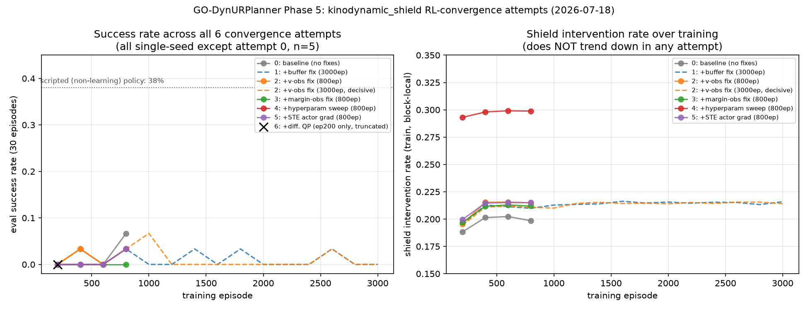

# Phase 5 RL-convergence investigation — full report for independent review

**Purpose of this document**: the commander (Claude/Sonnet 5, orchestrating this
research loop) has proposed stopping the RL-convergence investigation after six
negative results. The user asked, correctly, that this conclusion not be taken
on faith — it should be laid out with full background, an explicit reasoning
chain per attempt, real data/charts, and an honest accounting of what could
make the "stop" conclusion WRONG, then reviewed independently by a different
model (Codex, GPT-5.6 series) before being accepted. This document is written
to support that review. It is deliberately more complete and more skeptical of
its own conclusion than the working `ANALYSIS.md` notes were during the
investigation.

---

## 1. Background — what is being built and why RL matters here

GO-DynURPlanner is a research project extending a static-obstacle robot-arm
path planner (URPlanner lineage) to dynamic obstacles, using a 7-DoF Franka
Panda arm model. Phases 1-4 of the current track (documented in
`KINODYNAMIC_ROADMAP.md`) built a **kinodynamic certified safety shield**:
given a joint's `(q, v, a)` state and jerk as the control primitive, the
shield exactly certifies — via closed-form continuous-interval extrema
checks (Phase 1) and a jerk-horizon QP (Phase 2), gated by a cheap
terminal-braking-set membership check (Phase 3) — that a proposed velocity
command can be executed without violating joint position/velocity/
acceleration limits, and that the arm can still be brought to a stop from
the resulting state. This is a genuine, independently-verified contribution:
**Phase 5j's audit rolled out all 6 trained checkpoints for 18,000 total
steps and found zero endpoint violations, zero inter-sample violations, and
zero no-feasible-brake emergencies**, while the shield's fallback path
genuinely fired on 19-21% of steps (not a trivial always-pass result).

The open question is separate: **can a standard RL algorithm (TD3) actually
learn a good task policy while its actions pass through this shield?** The
new action interface (`u_t` maps to a nominal velocity `v_nom`, which the
shield may modify) is structurally different from the project's original,
already-working action interface (`u_t` maps directly to a position delta
`Δq`, unconstrained by the shield). Getting RL to converge under the new
interface is what Phase 5's `kinodynamic_shield` arm was built to test, and
it has not converged after six attempts to fix it.

## 2. The task, concretely

- Tabletop reach task: fixed home-ish start pose (±0.05 rad joint noise),
  goal sampled in a table-top region in front of the robot.
- Curriculum: stage 0 = 0 obstacles/0 speed (easiest); stage 1 = 2 obstacles
  at 0.10 m/s; stage 2 = 3 obstacles at 0.25 m/s. Advance after 100 episodes
  of ≥70% rolling success. **Every failed attempt below got stuck at stage
  0** — the curriculum never even started to ramp up.
- Success = flange within `goal_tol=0.05m` of goal for `goal_dwell=1`
  consecutive step (a lenient bar — momentary arrival counts).
- `max_steps=100` per episode; episode ends on success, collision, or
  timeout.
- Reward (`reward_mode="uoar"`): `-‖flange-goal‖ + 0.5·exp(-err/0.08) +
  (1.0 if err<goal_tol else 0) + ζ_c·UOAR(current overlap)`, plus (for the
  `kinodynamic_shield` arm only) `-0.1·‖v_nom - v_exec‖²`.
- Action interface under test (`kinodynamic_shield` arm): `u_t ∈ [-1,1]^7`
  maps to `v_nom = v_t + dv_scale·u_t` (`dv_scale ≈ DQ_MAX·dt`, an
  UNTUNED placeholder — flagged as such in the code since Phase 3). The
  shield computes the actually-executable jerk sequence; `env.step()`
  applies it.
- TD3 hyperparameters (baseline, before any sweep): `gamma=0.98, tau=0.01,
  lr=1e-3, hidden=256 (2 layers), policy_delay=2, expl_noise=0.25,
  batch=64`, actor/critics are plain MLPs.

## 3. Independent, established fact: the task IS solvable in this setup

A **scripted, non-learning** greedy policy (crude proportional control
toward the goal, no RL) was run for 100 episodes at stage 0 under the exact
same dynamics, shield, and step budget: **38% success rate, 0% collisions,
62% timeouts**. This rules out "the task is physically impossible at this
step budget" as an explanation for TD3's 0% success. It does NOT rule out
"the task is *hard to learn* even though it's *possible*" — those are
different claims, and the six attempts below were all aimed at the second
one.

## 4. The six attempts — full reasoning chain

Every attempt below (except #0, the original discovery run) was **single
seed** (n=1). This is the single most important methodological caveat in
this document — see §6.

### Attempt 0 — baseline (discovery run, n=5 seeds, 800 episodes)

No prior hypothesis; this is the run that revealed the problem. All 5 seeds:
succ 0.00-0.07 throughout, stage stuck at 0. `no_shield` and `ape2_shield`
arms (different, established action interface) trained normally in the same
800-episode budget on the same task (reaching 20-53% success, advancing
curriculum stages) — ruling out "the task/curriculum/reward is simply too
hard for TD3 in general" as an explanation, since the SAME algorithm on the
SAME task with a DIFFERENT action interface learns fine.

### Attempt 1 — replay-buffer action-consistency fix

**Hypothesis**: `m6_kinodynamic_shield.py` stored the RL actor's raw
*nominal* action in the replay buffer, but the shield can silently execute a
*different* action (~20% of steps). This makes `(s, a, r, s')` internally
inconsistent for TD3's critic on ~1/5 of transitions.
**Evidence supporting it**: verified by reading the code directly (not
speculation) — line-level confirmation of the bug.
**This is a real, independently-valid bug regardless of outcome** — a
data-consistency violation in an off-policy algorithm's training data is
wrong on its own terms, whether or not fixing it happens to unblock this
specific task.
**Fix**: exposed `env._last_executed_action` (inverting the executed `v_1`
back through the nominal mapping), used it in the buffer instead of the raw
action.
**Test**: 3000-episode single-seed run (matching the historical budget that
gets other arms to good performance). **Result**: succ stayed 0.00-0.07
across all 15 checkpoints, no trend, max ever seen 6.7% once.
**Verdict**: fix is correct and worth keeping; did not resolve the failure.

### Attempt 2 — missing velocity observation

**Hypothesis** (Opus-assisted diagnosis from a scripted-policy vs.
trained-policy behavioral comparison — see §5 for the diagnostic data):
`env.py`'s velocity-mode observation included acceleration but never
velocity itself — a genuine POMDP gap. A policy that cannot perceive its own
current speed cannot learn when to decelerate.
**Evidence supporting it**: direct code read confirmed `self.v` was absent
from `_state()`. The diagnostic evidence (trained policy moves substantially,
sometimes faster than the scripted policy, but always times out without
ever settling) is consistent with — though not uniquely explained by — a
missing-velocity POMDP.
**Fix**: added `self.v / DQ_MAX` to the observation.
**Test**: 800-episode probe, then a **decisive 3000-episode single-seed
run** (the strongest test in the whole investigation — full historical
budget, isolated single change). **Result**: succ stayed 0.00-0.03 across
all 15 checkpoints; max ever seen 6.7% once, at episode 1000, never
sustained or repeated.
**Verdict**: fix is correct (a policy should be able to perceive its own
velocity) but confirmed NOT sufficient alone, even given a full training
budget.

### Attempt 3 — missing safety-velocity-margin observation

**Hypothesis**: the user's own original design specification (documented
outside this codebase, in the design conversation that started this track)
called for a "positive/negative direction safety velocity margin" observation
feature — a signal for "how much velocity headroom remains before a
guaranteed stop is no longer possible," richer than raw velocity because it's
position- and braking-capability-aware. This was never implemented (only
acceleration and the intervention-magnitude scalar were).
**Fix**: added a bisection-based margin computation reusing the existing
closed-form `braking_witness_jerk` (no new QP calls).
**Cost found**: ~16-17ms/step at the function's own default resolution
(10 bisection rounds) — reduced to ~7.5ms/step at 4 rounds (coarser but
still functional; margin precision isn't safety-critical, only feeds an
observation).
**Test**: 800-episode single-seed probe.
**Result**: succ stayed 0.00 across all 4 checkpoints (worse-looking than
attempt 2's run at the same episode count, though single-seed noise at this
scale cannot distinguish "worse" from "same").
**Verdict**: correct implementation of a real design-spec gap; no
measurable benefit at this scale, plus a real added per-step cost.

### Attempt 4 — hyperparameter sweep

**Hypothesis, prioritized by an independent Opus consult** given all
accumulated evidence: (1) `dv_scale` — explicitly an untuned placeholder in
the code, directly governs how fast the arm can build speed *and* how much
margin remains to brake — top suspect given "moves substantially, never
settles" is a textbook mis-scaled-action-authority symptom; (2)
`expl_noise=0.25` — carried over unchanged from the OTHER, already-working
action interface, never retuned for a rate/velocity interface; (3)
`gamma=0.98` — under a 100-step episode with a reward that only pays a
one-time dwell bonus, the ~50-step effective horizon may undervalue late
goal arrival.
**Test**: ONE combined "best guess" config (`dv_scale×8, expl_noise=0.1,
gamma=0.99`), per Opus's explicit recommendation to test combined rather
than one-at-a-time given these are coupled through the same action
interface and isolated fixes had already failed.
**Result**: succ stayed 0.00-0.03 across all 4 checkpoints; **collision
rate rose to 0.83** (worse than the ~0.6-0.7 baseline), consistent with
`dv_scale×8` making the arm move more aggressively without a corresponding
task benefit.
**Verdict**: this specific combined guess failed. Does NOT rule out other
points in hyperparameter space — only 4 points (3 single-parameter
directions plus 1 combined) out of a large space were tested, single-seed.

### Attempt 5 — straight-through actor-gradient estimator (STE)

**Hypothesis** (raised independently by the user: "the safety layer can't
just restrict, it needs to feed back into learning"): TD3's actor loss
`-Q(s, actor(s))` always queries the critic at the actor's *raw* proposed
action, but the critic was trained on the *executed* (possibly
shield-modified) action. In the ~20-30% of steps where the shield
intervenes, the critic may never have observed the raw proposed action
actually being executed — a documented failure mode (extrapolation/OOD-action
error, cf. Fujimoto et al.'s BCQ, 2019).
**A first proposed fix (imitation loss toward the executed action) was
escalated to Opus and correctly rejected** before implementation: on
intervened steps the executed action IS the shield's generic conservative
brake, so directly imitating it risks teaching "safe but useless" behavior
exactly where task progress matters most.
**Actual fix (Opus-recommended)**: a straight-through estimator — the actor
loss's forward pass evaluates Q at the executed action (on-distribution,
where the critic is accurate), the backward pass routes the gradient to the
raw actor output unchanged.
**Test**: 800-episode single-seed probe, isolated from the attempt-4
hyperparameter changes (reverted to original `dv_scale`/`expl_noise`/`gamma`
to cleanly test this specific mechanism).
**Result**: succ stayed 0.00-0.03 across all 4 checkpoints — visually
indistinguishable from every prior attempt.
**Verdict**: theoretically well-motivated, correctly implemented (verified
via dedicated unit tests including a hooked check that the default path is
byte-identical to pre-existing behavior), no measurable benefit.

### Attempt 6 — real differentiable QP layer

**Hypothesis**: STE is an *approximation*. The theoretically correct fix
(Opus's explicitly stated preference, over both the imitation loss and STE)
is to backpropagate the actor's gradient through the ACTUAL safety QP via
implicit differentiation of its KKT conditions — giving the actor the exact
local gradient of "how would nudging my raw output change what the shield
lets through," not an approximation.
**Feasibility validated first, separately, before any production
integration**: a standalone prototype (commander-authored, `cvxpylayers`)
confirmed the forward solution matches the existing scipy-based QP solver to
~2×10⁻⁷ and the backward gradient matches a finite-difference check to
~4.6×10⁻⁵. This is a real, mathematically verified capability, not a leap of
faith.
**Production build**: verified independently (largest single dispatch of
the session) — 98/98 tests passing, confirmed genuine native batching (one
`CvxpyLayer` call with per-transition-varying constraint matrices on the
leading batch axis, not a disguised loop), confirmed the observation-layout
extraction (q/v/a from the actual `env._state()` output) matches ground
truth across both optional-feature configurations.
**Result**: the training probe was truncated after ~78 minutes (projected
total ~2.4 hours vs. ~12-13 minutes for the STE equivalent) once cost became
clearly prohibitive for iteration. The **one checkpoint obtained (ep200)**:
succ=0.00, intervention rate 0.198 — statistically indistinguishable from
every prior attempt's ep200 checkpoint.
**Verdict**: the theoretically most-principled fix, correctly implemented,
shows the identical failure signature at the one data point available, at
15-20× the computational cost. **This one data point is the weakest
evidence in the whole investigation** (only 200 of a planned 400 episodes,
and even 400 would have been shorter than most other attempts' 800).

## 5. The one clean diagnostic finding (not a fix attempt)

Separately from the six fixes, one **diagnostic-only** investigation (no
code change) directly compared a scripted policy against a trained
(post-fix, noise-free eval) policy at stage 0:

| | Success | Collision | Timeout | Median joint-speed (rad/s) | Episode length (steps) |
|---|---|---|---|---|---|
| Scripted (non-learning) | 38% | 0% | 62% | 0.086 | 90.0 mean / 100 median (73.7/76 on successes) |
| Trained (post buffer+v fixes) | 0% | 0% | 100% | 0.201 | 100/100 always |

The trained policy moves *more*, not less, than the successful scripted
policy, and never terminates via collision or success — it always runs the
full episode. This rules out "degenerate frozen/stationary policy" and
"obstacle-avoidance difficulty" (stage 0 has zero obstacles) as
explanations. It is consistent with, but does not uniquely prove, a
credit-assignment or exploration-statistics problem specific to this
double-integrator action space.

## 6. Honest statistical weakness — read this before trusting any "verdict" above

**Every attempt after #0 was a SINGLE SEED (n=1).** RL training is a
stochastic process; TD3 with different random seeds can and does produce
qualitatively different learning curves on the same task, sometimes
including seeds that fail to learn at all while others succeed. **The
"flat at 0%" pattern observed six times in a row is much weaker evidence of
"this configuration cannot learn" than it would be if each attempt had used
even 3-5 seeds.** It is entirely possible that:
- One or more of attempts 2-6 would show a genuinely different (better)
  outcome on a different seed, and the specific seed used (`2000000`,
  chosen for continuity with the original discovery run) is unlucky.
- The TRUE per-seed success probability for some of these fixes is
  low-but-nonzero (e.g., 10-20% of seeds converge), which a single sample
  would very plausibly miss entirely.

This was a deliberate, acknowledged tradeoff during the investigation (each
800-episode run costs ~15-70+ minutes depending on configuration; running
n=5 for every one of 6 attempts would have cost many additional hours) —
but it means **"six single-seed negative results" is meaningfully weaker
evidence than "six well-powered negative results."** Any reviewer should
weight this heavily.

## 7. Open, un-eliminated alternative hypotheses (raised by the user, not yet tested)

These were flagged by the user as plausible remaining explanations and have
**NOT** been rigorously tested or ruled out:

1. **Observation design/normalization beyond what was already fixed.**
   Direct inspection of `env.py::_state()` shows an inconsistency: `q_norm`,
   `v/DQ_MAX`, `a/DDQ_MAX`, and the margin terms are normalized to
   roughly `[-1,1]`/`[0,1]`, but `flange`, `goal`, and `goal-flange` are
   passed as RAW METERS (workspace region roughly `[-0.35, 0.70]` per axis
   — not wildly different in magnitude, but not consistently normalized
   either). Whether this genuinely matters for this network size (256-unit
   MLP, Adam optimizer, which are usually fairly robust to modest scale
   mismatches) is untested, not just unlikely-by-assumption.
2. **Reward-shaping mismatch with the advisor's real, working recipe.**
   The advisor's actual lab code (checked in `advisor_code/`, gitignored,
   never committed, cataloged in `code/advisor_code_catalog.md` and
   `code/ASSUMPTIONS.md`) uses a **discrete step-improvement PBRS** reward
   (`+0.05` if distance-to-goal decreased this step, else `-0.05`,
   similarly for orientation), NOT the continuous `0.5·exp(-err/0.08)`
   proximity bonus this codebase uses. The exponential term's specific
   decay scale (`0.08`) means it contributes negligible signal unless the
   arm is already within roughly 0.15-0.25m of the goal — for most of an
   episode, especially early in training, the reward is essentially just
   `-‖flange-goal‖` plus the (also mostly-inactive-until-close) UOAR term.
   Whether a step-improvement-style reward would give a cleaner, more
   consistent learning signal for a policy that must ALSO learn to
   decelerate (unlike the already-working delta-q arms, which don't need
   to reason about velocity at all) has not been tested. Also unresolved:
   `goal_dwell=1` here vs. the advisor's real `goal_dwell=50` — this
   codebase's setting is the MORE lenient one, so it is not an obvious
   explanation for failure, but the discrepancy itself was never
   investigated for downstream effects.
3. **Network capacity/architecture untouched.** Every attempt used the same
   256-unit, 2-layer MLP for actor and critics, inherited unchanged from the
   `no_shield`/`ape2_shield` arms' working configuration, despite the
   velocity-mode observation being substantially larger (47 dims vs. the
   base ~17-30) and the control problem being a genuine double integrator
   (arguably requiring more temporal/velocity reasoning capacity). Not
   tested.
4. **The `dv_scale` sweep only tried ONE alternative value (×8).** The
   placeholder's own reachable range spans orders of magnitude; a proper
   sweep (e.g., ×2, ×4, ×8, ×16, or a principled value derived from the
   jerk/accel limits directly) was not done — only Opus's single "best
   guess" combined config was tried before this thread was flagged for a
   scope decision.
5. **No completely fresh baseline re-check without ALL the accumulated
   fixes.** Every fix was tested additively (buffer fix, then +v-obs, then
   +margin-obs, ...) — there is no clean A/B isolating each fix's
   MARGINAL effect with proper statistical power; the sequence could be
   masking a fix that helps on some seeds but was tested on an unlucky one,
   or a fix whose benefit is only visible in combination with a change
   never tried (e.g., v-obs fix + reward reshaping together).

## 8. Chart

Left panel: eval success rate (30 episodes/checkpoint) vs. training episode,
for all six attempts (differentiable-QP attempt shown as a single truncated
point). Dotted line: the scripted non-learning policy's 38% reference. Right
panel: shield intervention rate over training — flat or slightly rising in
every attempt, never trending down (the hoped-for "policy learns to
self-limit" signature never appears).

## 9. What is asked of the reviewer (Codex, GPT-5.6 series)

This document, plus the underlying repo (`KINODYNAMIC_ROADMAP.md` iter18-40
for the full contemporaneous log, `code/godynur/env.py`,
`code/experiments/m6_kinodynamic_shield.py`, `code/godynur/td3.py`), is
provided for an INDEPENDENT, skeptical review — not implementation. Please:

1. State whether you agree the evidence supports "stop this specific
   thread, document as an honest open limitation" — or whether you think
   the single-seed weakness (§6) alone is disqualifying and more seeds
   should be run on the already-tried fixes before any conclusion.
2. Rank the open alternative hypotheses in §7 by (a) how likely each is to
   actually matter given everything in this document, and (b) how cheap
   each would be to test, independent of the commander's own priors (the
   commander suspects #2, the reward-shaping mismatch, may be
   under-weighted, but has not verified this — treat that as a hint to
   scrutinize, not a conclusion to defer to).
3. Specifically address the observation-normalization inconsistency (§7.1)
   and the reward-shaping mismatch (§7.2) the user explicitly raised —
   do either look, on inspection of the actual code, like a plausible
   primary cause rather than a minor contributor?
4. If you disagree with stopping, state the SINGLE next experiment you'd
   run first and why, with the same rigor standard as the rest of this
   document (a falsifiable prediction, not just "try X").

Keep the response evidence-grounded — cite specific files/lines/numbers
from this document or the repo, not general RL-training folklore.
